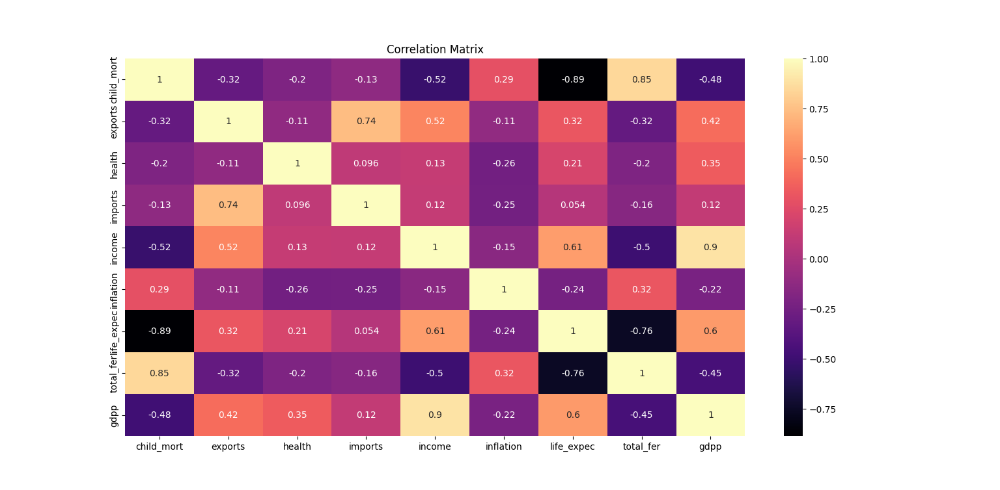
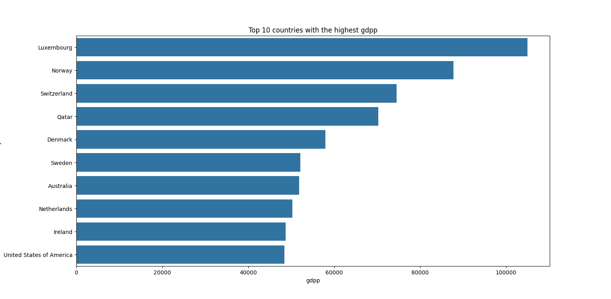
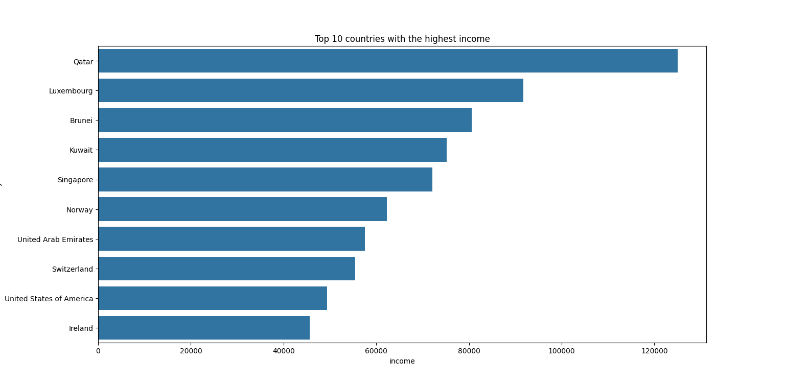
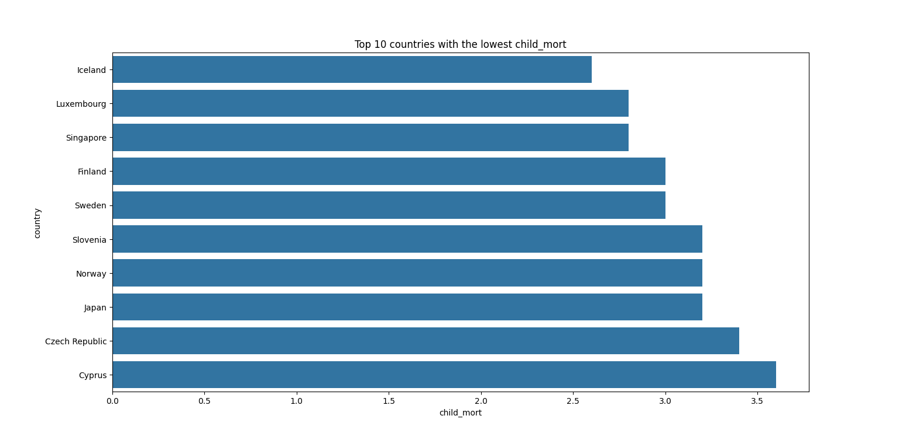
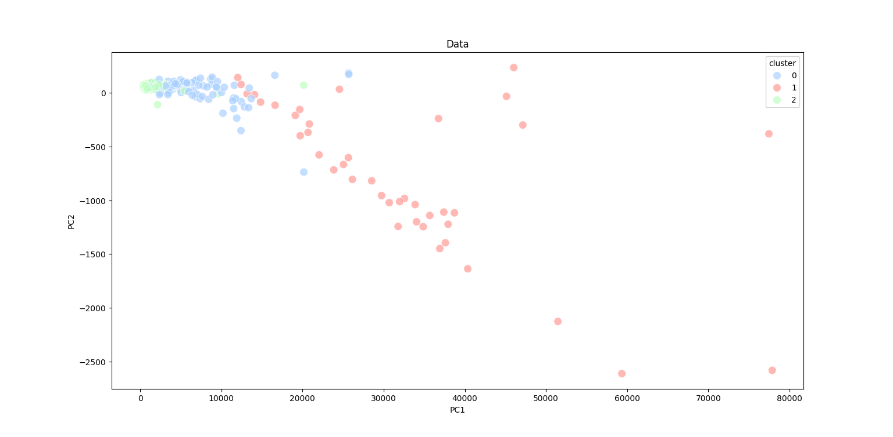
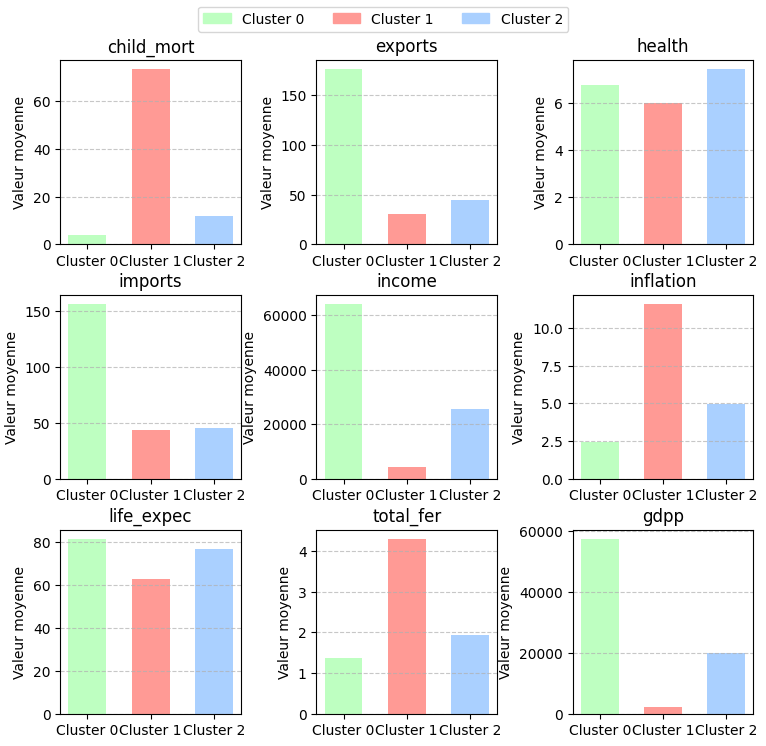
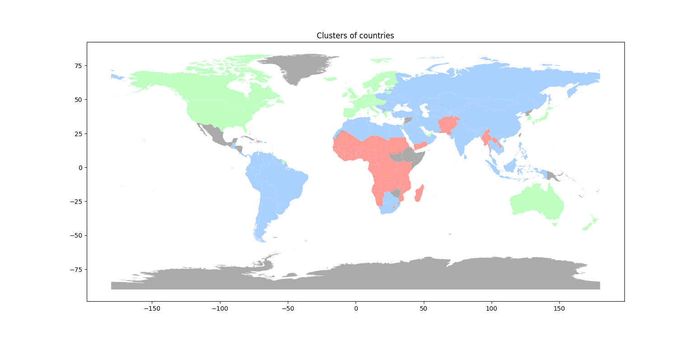

# TP DATA832 - Machine Learning

*Louna & Mathieu*

# Classification de pays selon le niveau d'aide nécessaire

## Présentation du dataset

Le dataset utilisé contient de nombreuses informations sur différents pays, notamment sur leur situation économique. Pour chaque pays, on dispose du nom du pays et de 9 features quantitatives : 

- `country` : le nom du pays
- `child_mort` : le taux de mortalité des enfants de moins de 5 ans (pour 1000 naissances)
- `exports` : le taux d'exportations de biens et services (en % du PIB)
- `health` : le taux de dépenses de santé (en % du PIB)
- `imports` : le taux d'importations de biens et services (en % du PIB)
- `income` : le revenu net moyen par personne
- `inflation` : le taux d'inflation annuel (en % du PIB) 
- `life_expec` : l'espérance de vie à la naissance
- `total_fer` : le nombre moyen d'enfants par femme
- `gdpp` : le PIB par habitant

Les données sont assez complètes, même s'il manque plusieurs pays (ex: Mexique) et que certains noms ne sont pas aux normes. Nous avons donc dû réaliser un nettoyage des données que l'on pouvait nettoyer (ex : United states -> United States of America).

## Choix de features

Pour déterminer quelles features sont les plus utiles, nous avons essayé plusieurs méthodes.

La première chose que nous avons tenté de faire est d'afficher la matrice de corrélations entre chaque variable, afin de ne plus prendre en compte les variables qui sont très corrélées, car elles transportent une information similaire. Le résultat ne nous a pas permis de déterminer réellement les variables les plus importantes mais on a pu voir quelques liens (ex: l'espérance de vie et la fertilité).

Nous avons ensuite essayé d'afficher des histogrammes pour voir les 10 valeurs supérieures (ou inférieures) de certaines variables spécifiques. Ces histogrammes n'aident pas beaucoup pour déterminer les meilleures features à utiliser mais ils permettent de voir s'il y a des redondances dans les pays (ex: les pays avec un taux de mortalité infantile élevé ont souvent un faible PIB par habitant). Voici des exemples de features très corrélées, on voit qu’en général ce sont les mêmes pays : 

On peut donc dire que les variables `gdpp`, `income` et `child_mort` sont très corrélées et peuvent assez bien être représentées par une seule variable. Dans le cadre du TP, nous avons choisi de ne pas éliminer immédiatement les features très corrélées puisqu’elles le seront quand nous ferons la réduction de dimensions (par l’analyse en composantes principales).

## Pipelining

Le modèle de pipeline que nous avons choisi se base sur :

- le prétraitement des données.
- l’analyse en composantes principales (PCA) pour la réduction de dimension tout en conservant un maximum d'informations. On va passer de 9 dimensions à 2 à 5 dimensions (en fonction du pipeline choisi). Il permet aussi d'éviter les redondances entre les variables corrélées comme avec l'espérance de vie et la mortalité infantile.
- les K-means pour le clustering. Il fonctionne très bien avec le PCA et permet d'avoir des clusters bien séparés rapidement.

Pour ce qui est du traitement des données, nous avons utilisé deux méthodes :

- `StandardScaler`, il transforme les données de manière à ce que chaque variable ait une moyenne de 0 et un écart-type de 1. Il est très utile pour adapter les données dans un modèle basé sur les distances (comme le nôtre) mais il est sensible aux valeurs extrêmes.
- `MinMaxScaler`, il transforme les données pour qu'elles soient comprises entre 0 et 1 (ou une plage définie). Il est bien adapté aux algorithmes sensibles à l'échelle mais il peut être très influencé par les valeurs extrêmes et n'est pas centré en 0.

Afin de déterminer quel pipeline et quels hyperparamètres sont les meilleurs, nous calculons le _silhouette score_ de chaque combinaison. 

Le _silhouette score_ est une métrique qui permet d’évaluer la qualité du clustering. Il mesure la ressemblance des données d’un même cluster (cohésion intra-cluster) tout en s’assurant que les clusters sont bien séparés les uns des autres (séparation inter-cluster.) Le _silhouette score_ est définie entre -1 et 1. Plus le résultat est proche de 1, plus les clusters sont bien définis et séparés. Aux alentours de 0, les clusters sont mal séparés voire se chevauchent. Une valeur négative indique un mauvais clustering (certains points sont dans le mauvais cluster). 

Le meilleur résultat est obtenu avec le pipeline suivant : 

- **Prétraitement** : `StandardScaler` 
- **Réduction de dimensions** : `PCA` (avec 2 composantes principales)
- **Clustering** : `K-means` (avec 3 clusters)

## Visualisations et analyse des résultats

Une fois le pipeline établi, chaque pays obtient une classe (0, 1 ou 2) grâce au K-means à 3 clusters. On peut afficher les différents points en fonctions des deux composantes de l’ACP (en affichant leur cluster comme couleur) : 

 

On voit ici de quelle manière ont été regroupés les pays, avec deux groupes très compacts (en vert et en bleu) et un groupe beaucoup plus dispersé (en rouge). 

Il est ensuite possible de calculer la valeur moyenne de chaque feature pour chacun des trois clusters, on peut donc les comparer. 

Sur les graphiques ci-dessus, on voit que le cluster rouge correspond aux pays qui ont besoin d’aide humanitaire (forte mortalité infantile, faible espérance de vie, forte inflation, faibles revenus…). Au contraire, le cluster vert représente les pays n’ayant pas du tout besoin d’aide (forts imports/exports, PIB par habitant élevé, faible mortalité…). Le cluster bleu se situe plus ou moins entre les deux pour la plupart des features (même s’ils sont largement en dessous du cluster vert pour plusieurs features).

Finalement, il est possible de mettre en forme ces données sur une carte du monde. Grâce à la librairie python `geopandas` et au clustering, il est possible de colorier chaque pays en fonction de la classe qui lui a été attribuée par l’algorithme. 

On remarque donc immédiatement que les pays “du Nord” sont généralement en vert, alors que les pays en voie de développement sont plutôt en rouge (surtout en Afrique subsaharienne et en Asie du Sud (Yémen, Pakistan, Afghanistan, Myanmar et Laos)). Cette visualisation a l’air fiable, en effet les pays en rouge sont effectivement ceux qui ont le plus besoin d’aide aujourd’hui. Nous avons testé plusieurs exécutions différentes et à chaque fois, le résultat change légèrement mais reste globalement le même (sauf quelques rares exceptions où le Luxembourg est le seul en vert 😭)

## Conclusion

Le modèle de clustering que nous avons mis en place semble être assez fiable pour déterminer les pays qui ont besoin d’aide humanitaire. Il est possible de l’améliorer en faisant un meilleur traitement des données, en ajoutant des données provenant d'autres datasets et en corrigeant les données manquantes. 

Au cours de ce TP, nous avons appris à manipuler la bibliothèque scikit-learn sur python (qui est super complète pour faire simplement des opérations qui seraient beaucoup plus longues sans), à utiliser des pipelines pour automatiser les traitements et à visualiser des données sur une carte du monde. L'utilisation de données réelles est très intéressante et nous a permis de voir comment des algorithmes de machine learning non-supervisés peuvent être utilisés pour résoudre des problèmes concrets.
